# Common LCD Monitor transformed in a RPi workstation
This project aims to recover an old, refurbished and outdated LCD display from HP in order to optionally use it with a Raspberry Pi (B,v1), I don't have a laptop and for a stationary/occasional usage at home this could be a nice solution. I don't need to use it in mobility so batteries are not an issue because AC power is a viable solution. For few basic tasks like editing files and compiling this is a good platform even without X, I occasionally use X with VNC to access remote environments as well. Monitor is not strictly dedicated to the Pi and keeps its original behavior, when the Pi is necessary it's usable just by connecting it through the HDMI cable and the dedicated power switch. The Rasbperry is embedded inside the monitor in some empty space HP has gently left inside it, after some mixed usage I didn't noticed overheating nor other strange symptoms.

Now this is usable as a common secondary monitor (for an external pc) or as a RPi workstation. Just connect the cable, turn on the switch and you're set.

# Bill of Materials:
- HP L1750 LCD monitor in my case, every monitor is fine but it's preferrable if it is a digital monitor (DVI-HDMI) or you need to use an active analog to digital converter
- Raspberry Pi model B v1 (512Mb) in my case but every RPi is fine
- Tontec USB WiFi 802.11N 150mbps adapter, or every usb wifi adapter compatible with the Pi
- 4 port Gowe usb Hub 2.0 or whatever hub you've around you, no special requirements for this as well
- Scrap 5V PSU ~ 2A.  Everything is fine but it's preferrable to use a separate power supply for the Pi in order to avoid to use monitor PSU, generally monitors power adapters are shaped for monitor peripherals and there's no room for additional current, since you need approx 5 or 10W from that it's better to use a separate one

# Disassembling
Disassemble your monitor, remove the panel, the power supply and the control board.
- Place the RPi inside the frame in a position where there's no risks of shortage, I have used a scrap piece of PLA to insulate it from the monitor shield. With a Dremel I have also cut part of the monitor frame in order to take advantage of the available space
- Do the same for the small power supply. In my case I have disassembled the power supply and left it without external plastic protection. To insulate it from the outside I have placed a polycarbonate sheet (the orange one) between him and the PSU. The pink foil on top of it is a silicone rubber thermal insulation sheet, it allows thermal excange but it also provides electrical insulation.
- On the bottom left side you can see ground/neutral/phase cables, these are connected to a small switch in the back of the monitor, this ensures to power on the RPi only when it's needed and not when the monitor is powered on
- On the bottom side there a dismantled USB Hub, no plastics to save space but properly connected to the Pi
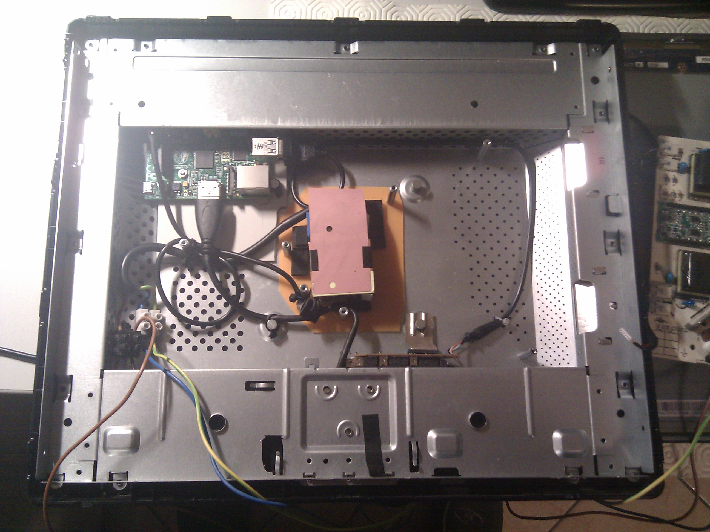
In a closer look you may better see the RPi, the modified chassis, the usb hub and the power supply
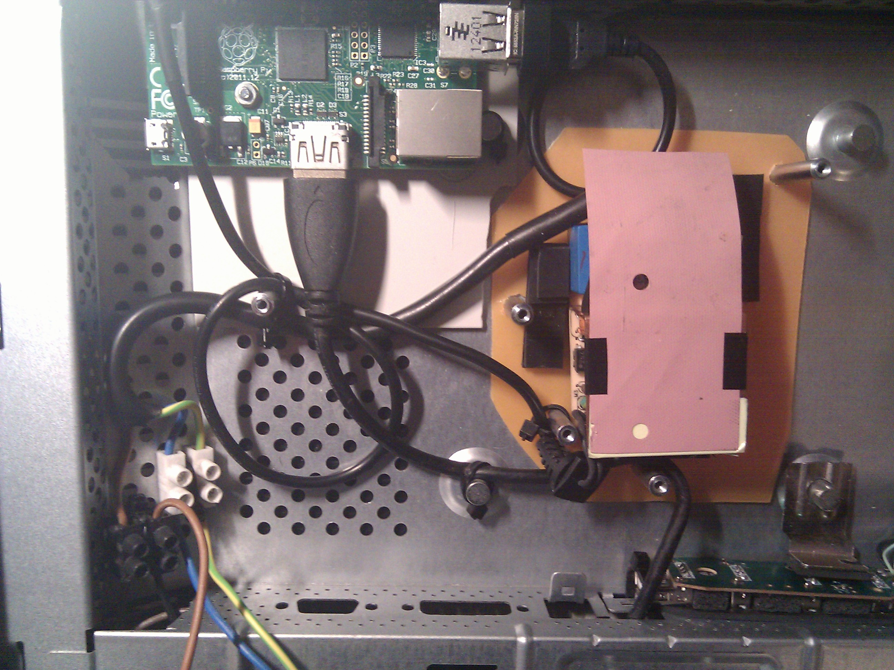
In order to precisely fit the Pi into the existing aluminium frame I have cut parts of it, here's a small detail of it
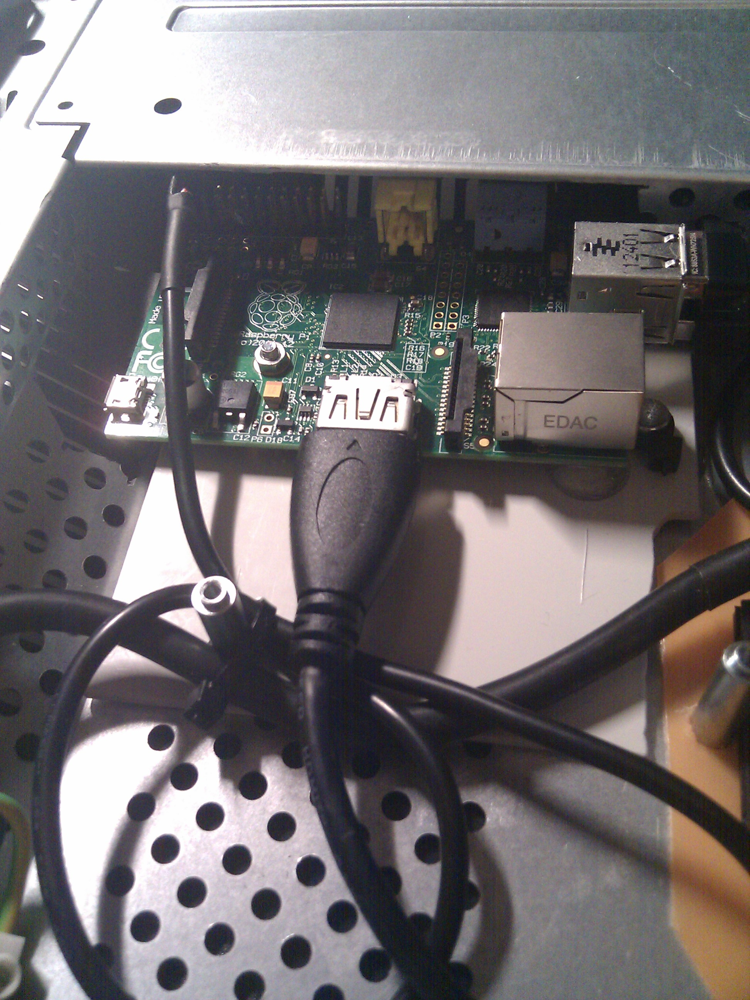

# USB Hub
To properly replicate usb ports under the monitor I have connected a repurposed usb hub to the Raspberry. This monitor wasn't designed to host a new board or an hub so spaces inside are really tight. That's why I have dismantled this hub in order to save some space. To keep insulation and provide a stable fit I have also added a thin foil of rubber between it and the case, this image shows it in deep
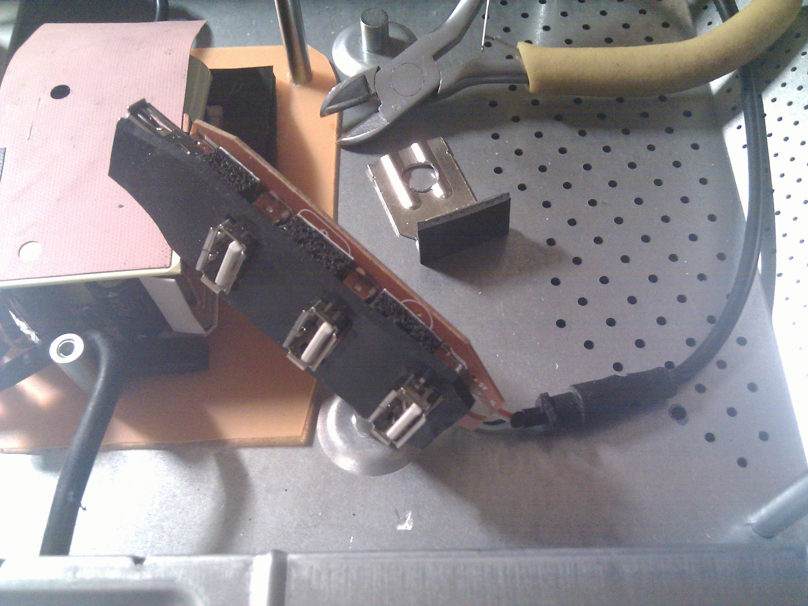
With a small L-Shaped aluminium part I have fixed it to the frame as this image shows you
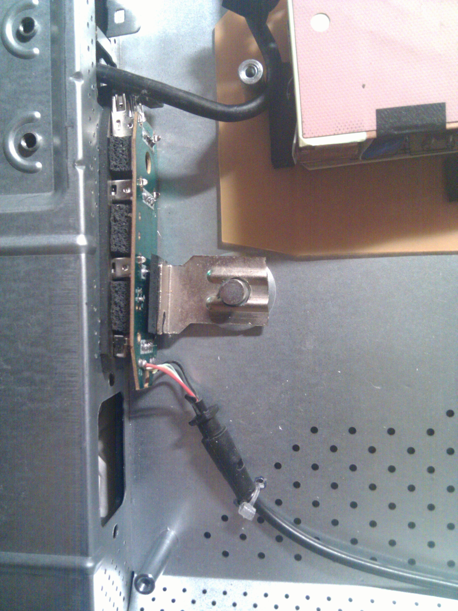
Few small cuts on the chassis are needed in order to expose the USB Hub
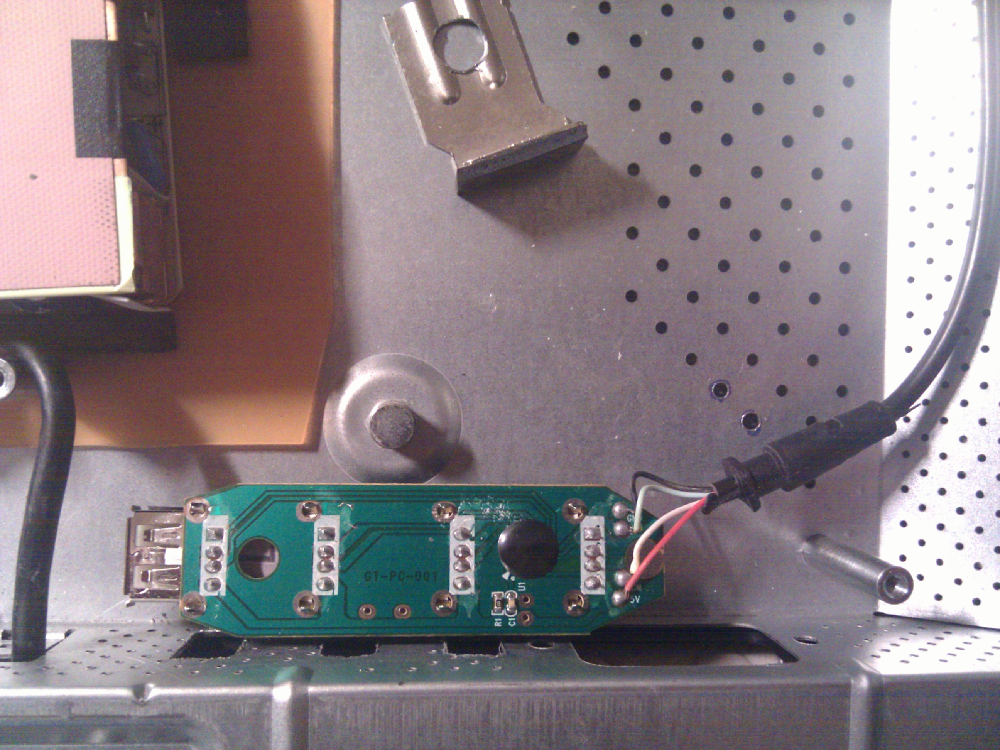

# Remounting
Now it's time to remount original electronics so I assembled original PSU for the monitor, from original boards I have also taken the mains in order to provide power to RPi's psu.
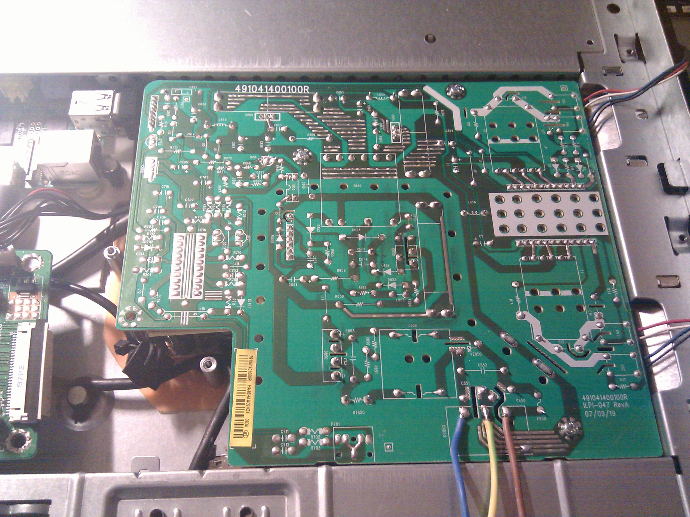
On the back plastic of the monitor I have also placed a switch for this new psu as you can see from the picture below
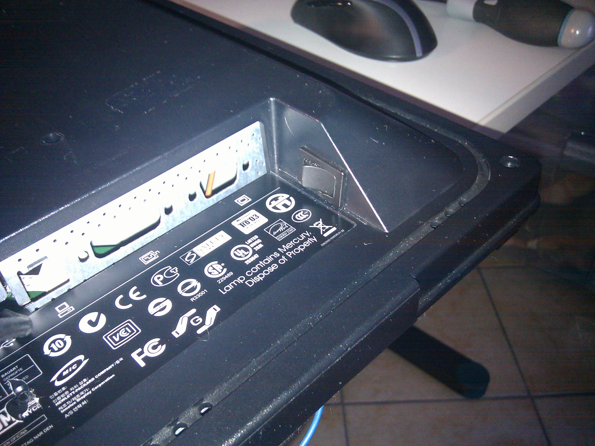
It's time to remount the electronic board that is connected to the power supply and to the lcd matrix:
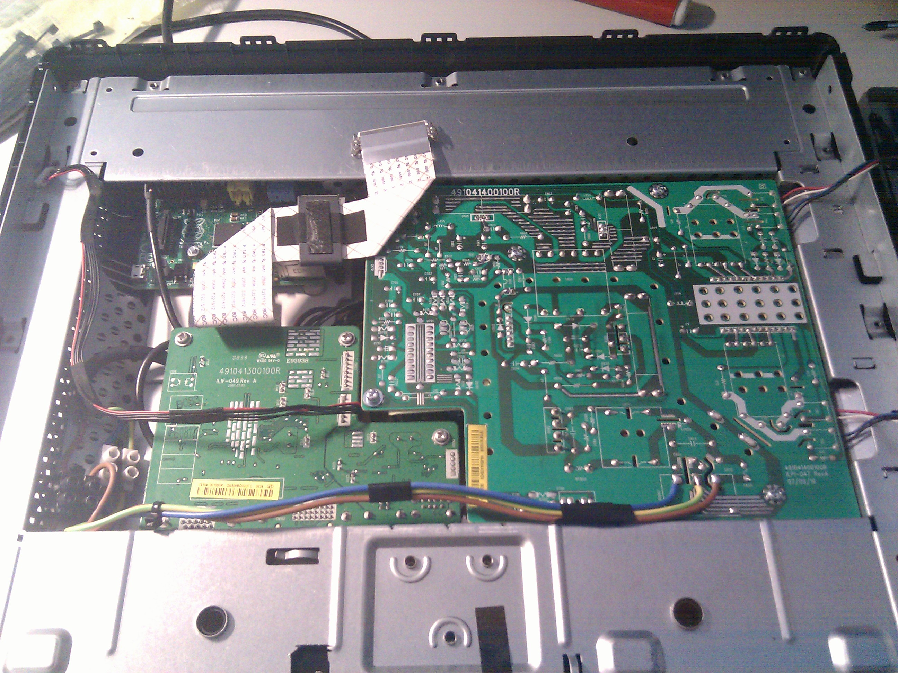
After remounting the screws and the plastics the project is finally completed

# Completed
Here's what's visible on the back panel, when the internal Pi is using the monitor the HDMI cable is connected to it, to use the monitor as a normal peripheral just remove the cable
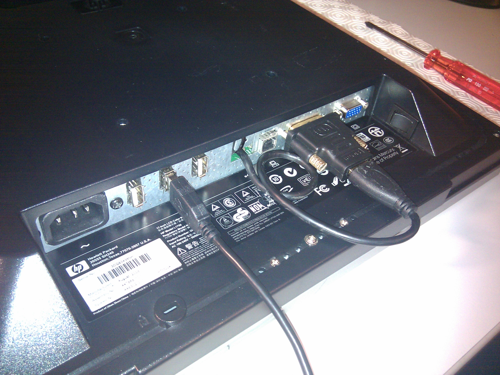
From the outside the SD card is slightly visible with a small slot on the top left
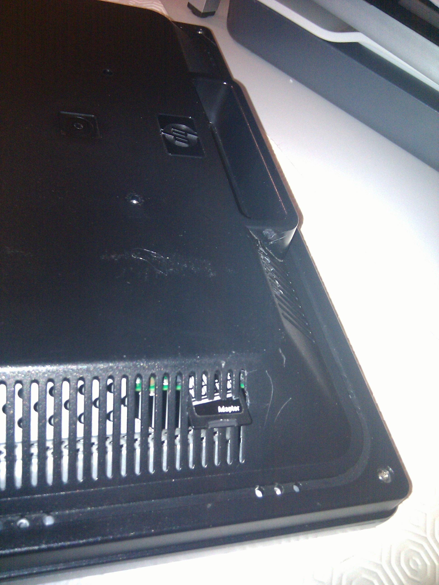

# Overview
Here's how it look like now after this mod:
Front:
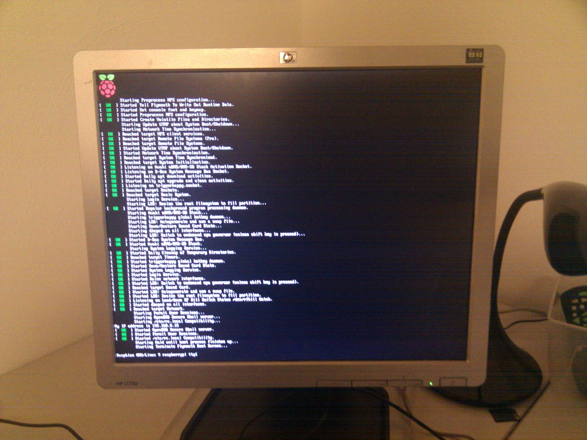
Back:
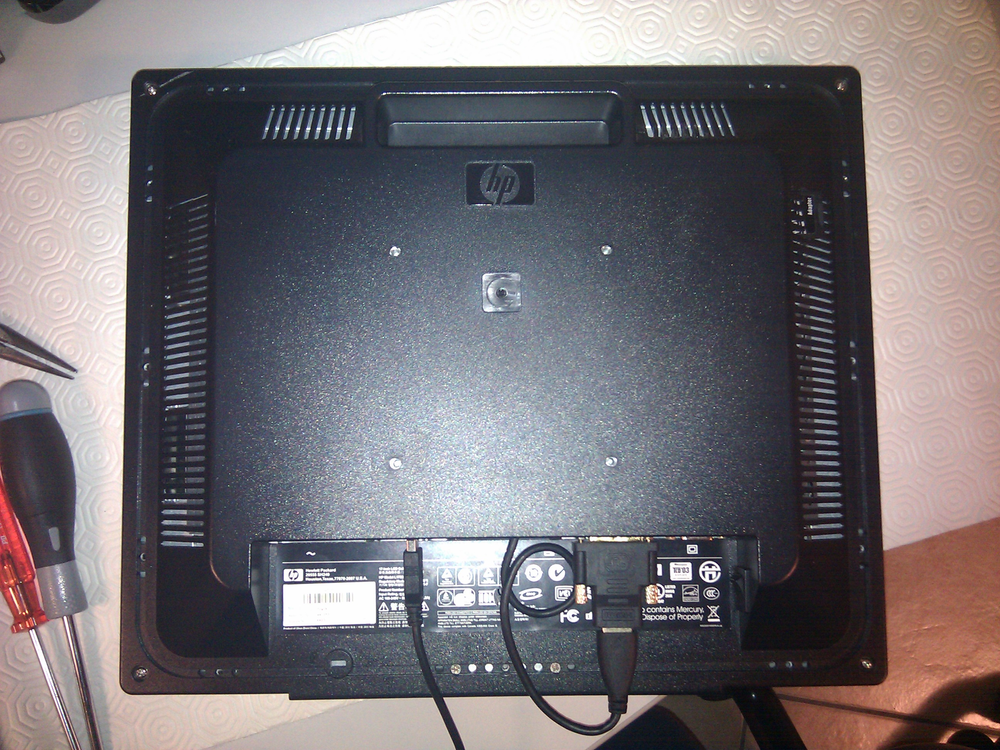
